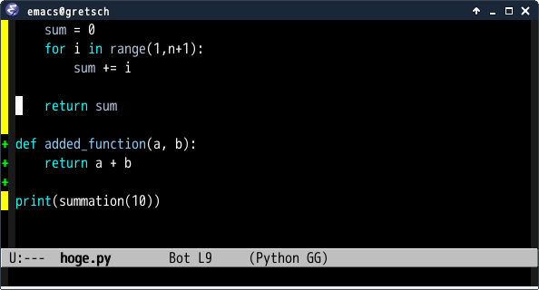

git-gutter+.el
==============

View, stage and revert Git changes straight from the buffer.

(`git-gutter+.el` is inspired by the [GitGutter](https://github.com/jisaacks/GitGutter)
plugin for Sublime Text.)


Changes since [Git-Gutter](https://github.com/syohex/emacs-git-gutter) 0.42
-------------

This package contains patches that haven't yet been added to [Git-Gutter](https://github.com/syohex/emacs-git-gutter).
- Improved performance
- Staging and committing hunks
- A bug-free `git-gutter-fringe.el` and other fixes
- The following interactive commands have been removed.
  They are superseded by `git-gutter+-mode`.
  - git-gutter
  - git-gutter:toggle
  - git-gutter:clear
- Removed mode-on/off-hook variables
- Renamed `git-gutter:diff-option` to `git-gutter:diff-options`

Get Started
-----------

* Install with package.el

  Add [MELPA](http://melpa.milkbox.net/#installing) or [Marmalade](http://marmalade-repo.org) as a package source.
  Run `M-x package-install git-gutter+`

* Add the following to your .emacs file

        (global-git-gutter+-mode t)

  If you want to disable git-gutter+ for some modes, set the variable
  `git-gutter+-disabled-modes`.

  As an alternative to `global-git-gutter+-mode` you can enable git-gutter+ only for
  specific modes, like this:

        (add-hook 'ruby-mode-hook 'git-gutter+-mode)
        (add-hook 'python-mode-hook 'git-gutter+-mode)

* Add keybindings

        ;;; Jump between hunks
        (global-set-key (kbd "C-x n") 'git-gutter+-next-hunk)
        (global-set-key (kbd "C-x p") 'git-gutter+-previous-hunk)

        ;;; Act on hunks
        (global-set-key (kbd "C-x v =") 'git-gutter+-show-hunk)
        (global-set-key (kbd "C-x r") 'git-gutter+-revert-hunk)
        ;; Stage hunk at point.
        ;; If region is active, stage all hunk lines within the region.
        (global-set-key (kbd "C-x t") 'git-gutter+-stage-hunks)
        (global-set-key (kbd "C-x c") 'git-gutter+-commit) ; Commit with Magit
        (global-set-key (kbd "C-x C") 'git-gutter+-stage-and-commit)

        (global-set-key (kbd "C-x g") 'git-gutter+-mode) ; Turn on/off in the current buffer
        (global-set-key (kbd "C-x G") 'global-git-gutter+-mode) ; Turn on/off globally

[git-gutter-fringe+.el](https://github.com/nonsequitur/git-gutter-fringe-plus)
-----------------------


*(git-gutter-fringe+ with minimal skin)*

[git-gutter-fringe+.el](https://github.com/nonsequitur/git-gutter-fringe-plus) uses
the fringe to display diff markers, instead of the buffer margin.

These are the differences to the default margin display mode in git-gutter+:

|                          | git-gutter+.el | git-gutter-fringe+.el |
|:-------------------------|:-------------:|:--------------------:|
| Works in tty frame       | +             | -                    |
| Works with linum-mode    | -             | +                    |
| Gutter on the right side | -             | +                    |

Enable git-gutter-fringe+ like this:

    M-x package-install git-gutter-fringe+
    (require 'git-gutter-fringe+)

    ;; Optional: Activate minimal skin
    (git-gutter-fr+-minimal)

Commands
--------

#### `git-gutter+-mode`
Enable/disable git-gutter+ in the current buffer.

#### `global-git-gutter+-mode`
Globally enable/disable git-gutter+ for all file buffers.

#### `git-gutter+-next-hunk`

Jump to the next hunk.

#### `git-gutter+-previous-hunk`

Jump to the previous hunk.

#### `git-gutter+-show-hunk`

Show detailed diff for the hunk at point.

The hunk info is updated when you call
`git-gutter+-next-hunk` and `git-gutter+-previous-hunk`.

#### `git-gutter+-revert-hunk`

Revert hunk at point.

#### `git-gutter+-stage-hunks`

Stage hunk at point. If region is active, stage all hunk
lines within the region.

#### `git-gutter+-commit`

Commit staged changes with Magit.

#### `git-gutter+-stage-and-commit`

Calls `git-gutter+-stage-hunks` followed by `git-gutter+-commit`.

Requirements
------------

* Emacs 23 or higher
* Magit, if you use the committing features.
* [Git](http://git-scm.com/) 1.7.0 or higher

Tramp
-----

Git-Gutter supports TRAMP for remote file support.

This section of the manual hasn't yet been cleaned up.
======================================================

## Customize

### Look and feel


You can change the signs and those faces.

```elisp
(setq git-gutter+-modified-sign "  ") ;; two space
(setq git-gutter+-added-sign "++")    ;; multiple character is OK
(setq git-gutter+-deleted-sign "--")

(set-face-background 'git-gutter+-modified "purple") ;; background color
(set-face-foreground 'git-gutter+-added "green")
(set-face-foreground 'git-gutter+-deleted "red")
```

You can change minor-mode name in mode-line to set `git-gutter+-lighter`.
Default is " GitGutter"

```elisp
;; first character should be a space
(setq git-gutter+-lighter " GG")
```


### Using full width characters


Emacs has `char-width` function which returns character width.
`git-gutter+.el` uses it for calculating character length of the signs.
But `char-width` does not work for some full-width characters.
So you should explicitly specify window width, if you use full-width
character.

```elisp
(setq git-gutter+-window-width 2)
(setq git-gutter+-modified-sign "☁")
(setq git-gutter+-added-sign "☀")
(setq git-gutter+-deleted-sign "☂")
```

### Disabled modes

If you use `global-git-gutter+-mode`, you may want some modes to disable
`git-gutter+-mode`. You can make it by setting `git-gutter+-disabled-modes`
to `non-nil`.

```elisp
;; inactivate git-gutter+-mode in asm-mode and image-mode
(setq git-gutter+-disabled-modes '(asm-mode image-mode))
```

Default is `nil`.

### Show Unchanged Information



`git-gutter+.el` can view unchanged information by setting `git-gutter+-unchanged-sign`.
Like following.

```elisp
(setq git-gutter+-unchanged-sign " ")
(set-face-background 'git-gutter+-unchanged "yellow")
```

Default value of `git-gutter+-unchanged-sign` is `nil`.

### Show a separator column


`git-gutter+.el` can display an additional separator character at the right of the changed
signs. This is mostly useful when running emacs in a console.

```elisp
(setq git-gutter+-separator-sign "|")
(set-face-foreground 'git-gutter+-separator "yellow")
```

Default value of `git-gutter+-separator-sign` is `nil`.

### Hide gutter if there are no changes

Hide gutter when there are no changes if `git-gutter+-hide-gutter` is non-nil.
(Default is nil)

```elisp
(setq git-gutter+-hide-gutter t)
```

### Extra arguments for 'git diff'

You can force extra arguments to be passed to `git diff` by setting
`git-gutter+-diff-options`.

```elisp
;; Ignore all spaces
(setq git-gutter+-diff-options '("-w"))
```

## See Also

### [GitGutter](https://github.com/jisaacks/GitGutter)

GitGutter is Sublime Text plugin.

### [diff-hl](https://github.com/dgutov/diff-hl)

`diff-hl` has more features than `git-gutter+.el`.

### [vim-gitgutter](https://github.com/airblade/vim-gitgutter)

Vim version of GitGutter
